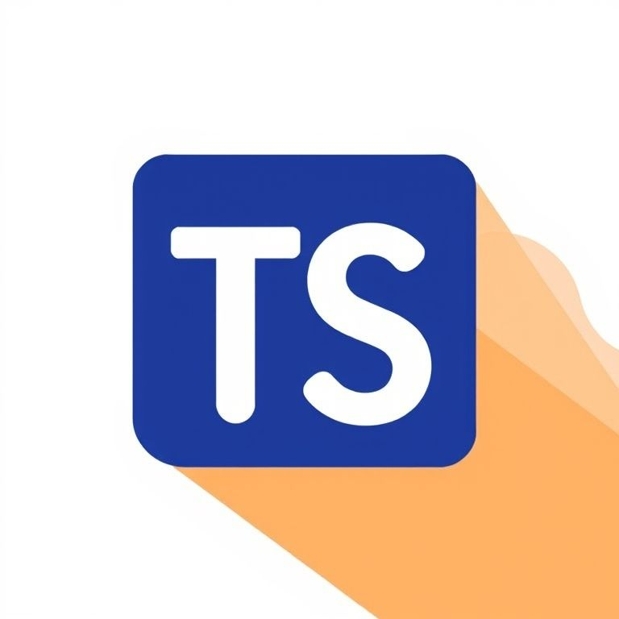

# TypeScript Eğitim Projesi 🚀

<div align="center">
  

  [](https://www.typescriptlang.org/)
  [](LICENSE)
  [](http://makeapullrequest.com)
  [](https://github.com/your/repo/graphs/commit-activity)
  [](README.md)

  [English](README_EN.md) | [Türkçe](README.md)
</div>

Bu proje, TypeScript'i temel seviyeden ileri seviyeye kadar öğrenmek isteyenler için hazırlanmış kapsamlı bir eğitim materyalidir.

## 📚 Proje Yapısı

Proje dört ana bölümden oluşmaktadır:

### 1. Temel Öğrenme Materyalleri (`/learning_basics`)
- Interface tanımları ve kullanımları
- Type sistemleri ve type aliases
- Union ve intersection types
- Function types ve implementations
- Generic types
- Ve daha fazlası...

### 2. Örnek Projeler (`/sample_projects`)
- Calculator uygulaması
- E-commerce interface örneği
- Shape hesaplamaları
- Generic type implementasyonları
- Union types pratik kullanımı

### 3. Ödevler (`/homework`)
Pratik yapmanız için hazırlanmış örnek problemler:
- sample1.ts - sample5.ts

### 4. Öğrenme İpuçları (`/tips`)
- Best practices
- Kod organizasyonu
- Type safety önerileri
- Ve daha fazlası...

## 🎯 Öğrenme Yolu

1. **Başlangıç Seviyesi**
   - basic_interface_sample.ts
   - type_sample.ts
   - interface_samples.ts

2. **Orta Seviye**
   - interface_expand.ts
   - union_type_sample.ts
   - intersection_types.ts

3. **İleri Seviye**
   - functiontypes_implementing_interface.ts
   - generic_types.ts
   - types_implementing_datastructure.ts

## 💡 Önemli Konular

### Interface Kullanımı
```typescript
interface User {
    name: string;
    age: number;
    email?: string; // Opsiyonel property
}
```

### Type Aliases
```typescript
type Result = number | string;
type Coordinates = [number, number];
```

### Generic Types
```typescript
function filterArray<T>(array: T[], predicate: (item: T) => boolean): T[] {
    return array.filter(predicate);
}
```

## 🚀 Başlarken

1. Repository'yi klonlayın
2. TypeScript'i yükleyin: \`npm install -g typescript\`
3. Dosyaları sırayla inceleyin ve çalıştırın
4. Her bir örneği anlayarak ilerleyin
5. Ödevleri tamamlayın

## 📝 Çalışma Önerileri

1. **Sıralı İlerleme**
   - Temel konulardan başlayın
   - Her örneği çalıştırarak test edin
   - Konseptleri iyice anlayın

2. **Pratik Yapma**
   - Homework klasöründeki ödevleri yapın
   - Sample projects'teki örnekleri inceleyin
   - Kendi varyasyonlarınızı oluşturun

3. **Best Practices**
   - Tips klasöründeki önerileri okuyun
   - Clean code prensiplerini uygulayın
   - Type safety'e dikkat edin

## 🎓 Öğrenme Hedefleri

- TypeScript type sistemini anlama
- Interface ve type kullanımında uzmanlaşma
- Generic types ile çalışabilme
- Real-world uygulamalar geliştirebilme
- Type safety prensiplerini uygulayabilme

## 🛠️ Gereksinimler

- Node.js
- TypeScript
- Bir kod editörü (VS Code önerilir)

## 📈 İlerleme Takibi

1. Her bir temel konsepti öğrendikten sonra örnek projelere göz atın
2. Ödevleri tamamlayarak kendinizi test edin
3. Tips klasöründeki önerileri uygulayın

## 🤝 Katkıda Bulunma

1. Fork yapın
2. Yeni bir branch oluşturun
3. Değişikliklerinizi commit edin
4. Pull request gönderin

## 📄 Lisans

Bu proje [MIT Lisansı](LICENSE) altında lisanslanmıştır. Detaylar için `LICENSE` dosyasına bakınız.
